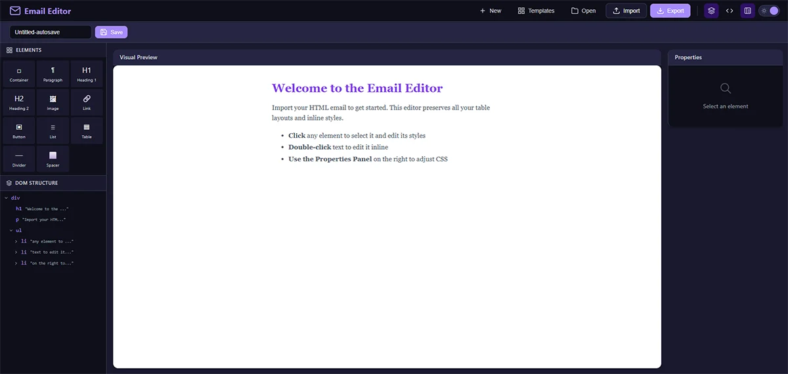

# HTML Email Editor

<div align="center">

  
  
  <h1>HTML Email Editor</h1>
  
  <p>
    <strong>A powerful, visual email builder for everyone.</strong>
  </p>

  <p>
    <a href="#features">Features</a> •
    <a href="#quick-start">Quick Start</a> •
    <a href="#tech-stack">Tech Stack</a> •
    <a href="#license">License</a>
  </p>


  <br />
  <br />



</div>

<br />

## � About

**HTML Email Editor** simplifies the process of creating responsive, professional email templates. Whether you're a marketer, developer, or business owner, you can design beautiful emails without touching a single line of code. Import existing HTML, edit visually, and export clean code ready for your favorite marketing platform.

## ✨ Features

- � **Visual Editing** - Intuitive drag-and-drop interface.
- � **Smart Import** - Paste HTML or upload files directly.
- 🎨 **Rich Styling** - Full control over fonts, colors, and layout.
- 🏗️ **Drag & Drop Blocks** - Pre-built components for images, buttons, and text.
- 🌙 **Dark/Light Mode** - Comfortable editing in any environment.
- 👁️ **Live Code Preview** - Real-time HTML generation side-by-side.
- 💾 **Template Management** - Save drafts and reuse templates instantly.
- 🔐 **Secure Access** - Simple JWT-based authentication to protect your work.
- 📤 **One-Click Export** - Download or copy production-ready HTML.

## 🚀 Quick Start

### Prerequisites

- **Node.js**: v18 or higher
- **npm** or **yarn**

### Installation

```bash
# Clone the repository
git clone https://github.com/yourusername/HTML_EmailEditor.git
cd HTML_EmailEditor

# Setup Environment Variables
cp env.example .env
# Edit .env and set your ADMIN_USER and ADMIN_PASS

# Install Backend Dependencies
cd backend
npm install

# Install Frontend Dependencies
cd ../frontend
npm install
```

### ⚡ Running the Application

You'll need three terminal tabs to run the full stack:

**1. Backend Server**

```bash
cd backend
npm run dev
# 🚀 API running on http://localhost:3001
```

**2. Frontend Application**

```bash
cd frontend
npm run dev
# 🌐 App running on http://localhost:5173
```

**3. Documentation (Optional)**

```bash
cd docs
npm run docs:dev
# 📚 Docs running on http://localhost:5174
```

Visit **[http://localhost:5173](http://localhost:5173)** to start editing!

## 🛠️ Tech Stack

| Layer        | Technology       | Description                          |
| ------------ | ---------------- | ------------------------------------ |
| **Frontend** | React 18, Vite   | Fast, modern UI library and bundler. |
| **Editor**   | TipTap           | Headless wrapper for ProseMirror.    |
| **Backend**  | Node.js, Express | Lightweight REST API.                |
| **Storage**  | Local JSON       | Simple filesystem-based persistence. |

## 📂 Project Structure

```bash
HTML_EmailEditor/
├── frontend/          # React application
│   ├── src/
│   │   ├── components/
│   │   └── api/
├── backend/           # Express server
│   ├── data/          # JSON data storage
│   └── server.js      # API entry point
├── docs/              # VitePress documentation
└── README.md          # Project documentation
```

## 📄 License

This project is licensed under the [MIT License](LICENSE).

---

<div align="center">
  <sub>Built with ❤️ for better emails everywhere.</sub>
</div>
